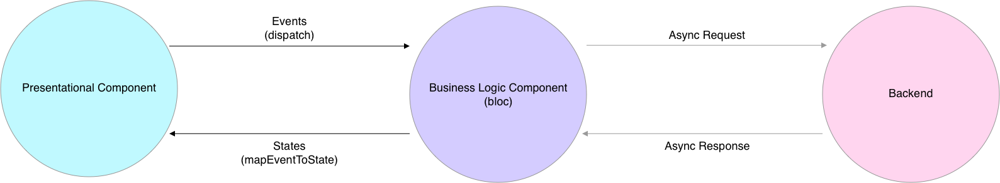

# 【Flutter】BLoC Package の Architecture について

## 概要

本記事はbloc package の[Architecture](https://felangel.github.io/bloc/#/architecture)ページの要約となります。

筆者の理解した範囲内で

Flutter の BLoC Packageの Core Architecture について記述します。

## BLoC Packageとは

BLoC とは、一般的に

Bussiness Logic Component

のことであり、

State Management を

- 効率的に
- 整合性を保持し
- 一貫性を持って

行うために提唱されている

一種のパターン化された方法論(パターン)

です。

それをパッケージ化して、

手法を定型化したものが

[Bloc Package](https://felangel.github.io/bloc/#/)

となります。

## Architecture

公式サイトを引用した、

大まかなArchitectureの図式となります。

要は、

- Data
  - Data Provider
  - Repository
- Business Logic
- Presentation

に分かれているようになっております。

### Data

Data Layer は、

`> The data layer's responsibility is to retrieve/manipulate data from one or more sources.`

とあるように、

>Data Layerの役割とは、1つ以上の Source からデータを取得/操作することです。

そして、Data Layerは、以下の二つのパーツに分けることができます。

- Repository
- Data Provide

## 最後に

最後に  
間違いやご指摘などが御座いましたらご教示願います！